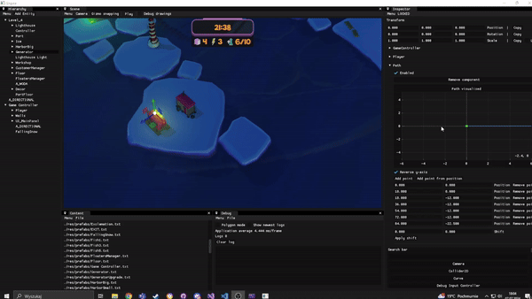

<h1 align="center"><b>Guiding Light</b></h3>

  

## What is it?
Guiding Light is a game developed along it's own game engine in 4 months.

## Story
You're a lighthouse keeper and a courier… at once. In "Guiding Light", a casual time-management game, you operate alone in the Pole of Cold. And you’re the only one who can feed the penguins! Guide the ships, pick-up the food rations, and upgrade your lighthouse. Get ready to prevent shipwrecks and master the polar night!

## How to play?
Go to: https://oelj.itch.io/guiding-light
## Engine
Our engine is based on **Entity-Component architecture used by Unity**. We use **DirectX 11** as our graphics API (initially it was OpenGL, we decided to port it). Editor's UI was made with **ImGui** and it's extensions: **ImGuizmo, ImPlot**. 

## Editor

  

We developed our own editor along with countless tools and functionalities:

* Scene and prefab loading
* Gizmos
* Curve editors
* Debug drawings
* Debug logging
* Shader hot-swapping

## EngineHeaderTool
To speed up our work, we wrote a python script that generates (de)serialization code
for all Components, just like [UnrealHeaderTool](https://docs.unrealengine.com/4.27/en-US/ProductionPipelines/BuildTools/UnrealHeaderTool/). (We are very proud of that.)

## Rendering
We managed to implement a couple of rendering algorithms:
* Screen Space Reflection
* Screen Space Refraction
* Volumetric light scattering
* Screen Space Ambient Occlusion (SSAO)
* Particles (and particle emitters)
* Fast Approximate Anti-Aliasing (FXAA)
* Gerstner waves (for water geometry)
* Shadow mapping (also including point lights)
* Percentage-Closer Soft Shadows

## Awards
🏆 **[ZTGK 2024](https://gry.it.p.lodz.pl/main/index.php/pl/) Game Development category winner**

🏆 **[ZTGK 2024](https://gry.it.p.lodz.pl/main/index.php/pl/) Activision special award winner**

## Credits
| Name | Link | Role |
|------|--------|--------|
| Mikołaj Przybylski | https://github.com/0GreenClover0| Programming Lead |
| Michał Galiński | https://github.com/MikeMG-PL| Production Lead |
| Jakub Januszewicz  | https://github.com/boniffacy | 2D & Branding Lead |
| Miłosz Kawczyński  | https://github.com/MiloszKawczynski | Design Lead |
| Nadia Kowalska  | https://github.com/nadkow | 3D Art Lead |
| Hubert Olejnik | https://github.com/umbc1ok | Rendering Lead |
| Michał Świstak | | Sound Design |
| Julian Rakowski |https://www.linkedin.com/in/julian-rakowski/ |  Voice Acting |